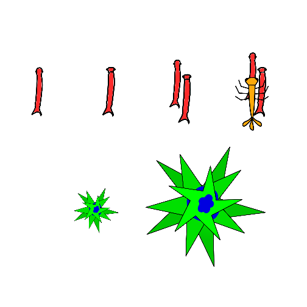
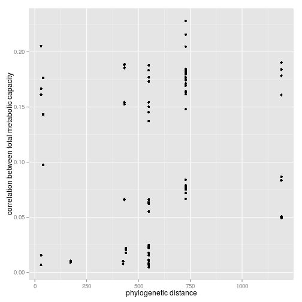
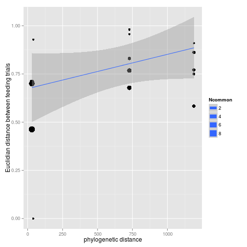
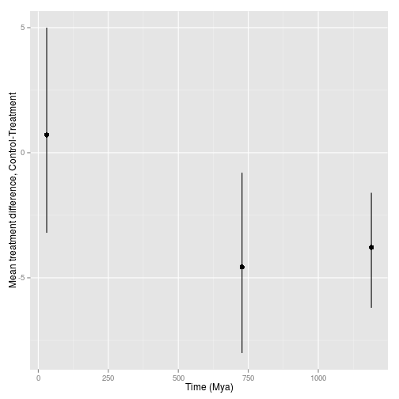
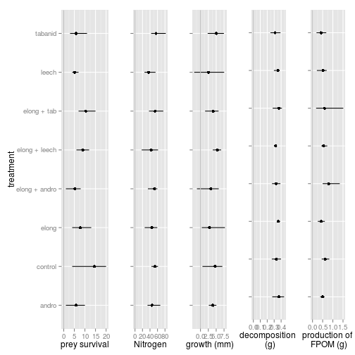
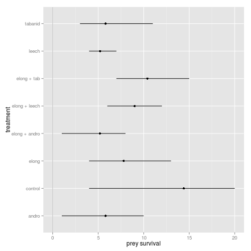

## Hi I'm Andrew

* PhD student at Diane Srivastava's lab at UBC
* Field work in Brazil 

--- 
## Co-occurance data

---
## Diet similarity

---
## experimental design

---
## experimental responses

---

